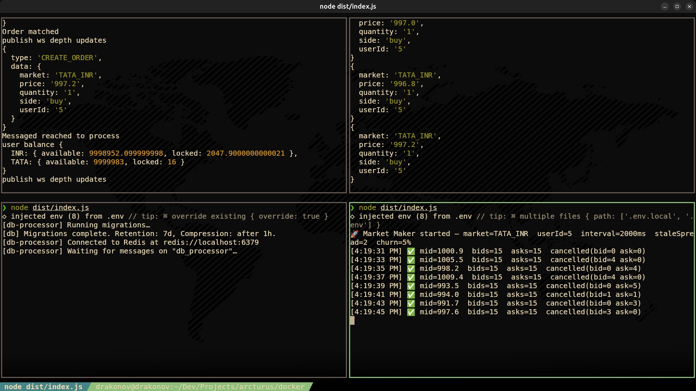
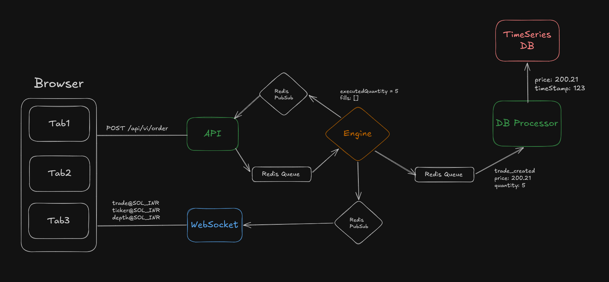
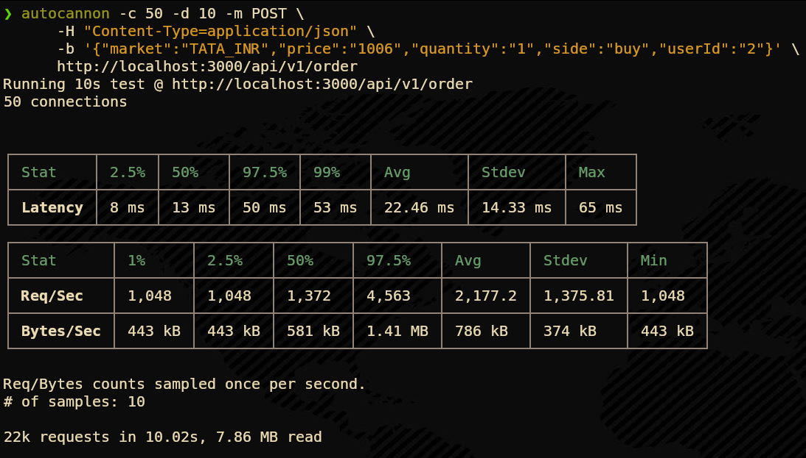
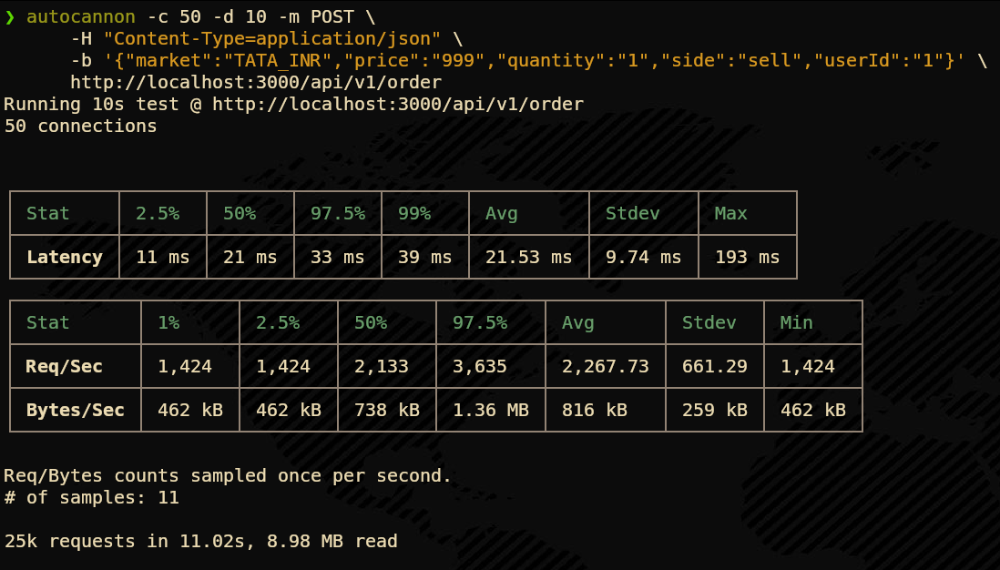
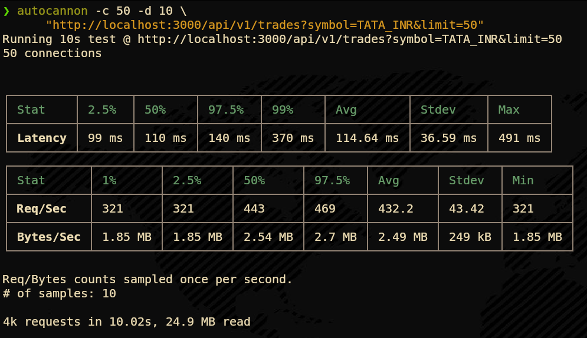
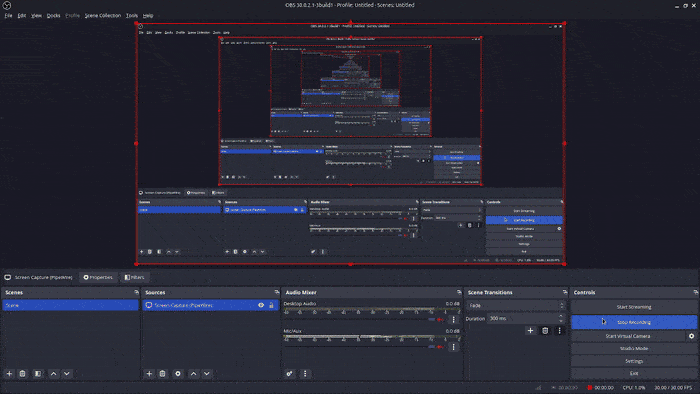
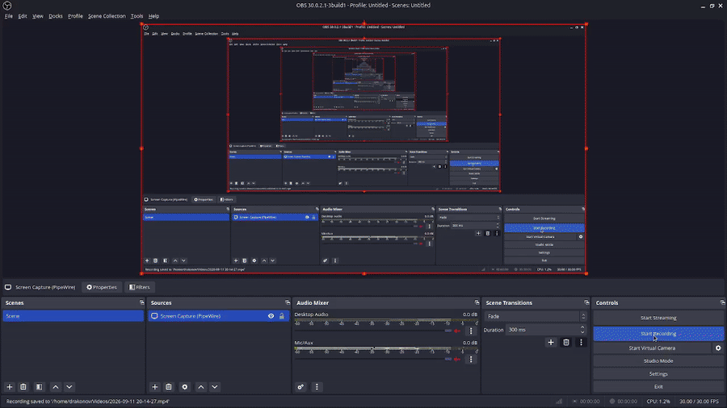

# Arcturus ⚡
> A high-performance, real-time cryptocurrency exchange backend — built from scratch.

Arcturus is a full-stack exchange engine inspired by how platforms like Binance work internally. It implements a **price-time priority matching engine**, **real-time WebSocket market data**, **asynchronous persistence via TimescaleDB**, and a **self-sustaining market maker bot** — all connected through a Redis message bus.



---

## 🏗️ Architecture



---

## 🧩 Services

| Service | Port | Responsibility |
|---|---|---|
| `api` | 3000 | REST gateway — accepts orders, serves depth/trades/klines |
| `engine` | — | In-memory matching engine, single-threaded, price-time priority |
| `ws` | 3001 | WebSocket server — real-time market data via Redis Pub/Sub |
| `db-processor` | — | Async DB writer — persists trades and orders to TimescaleDB |
| `market-maker` | — | Algorithmic liquidity bot — keeps the order book alive |

---

## ⚙️ Tech Stack

- **Runtime:** Node.js + TypeScript
- **API:** Express.js
- **Message Bus:** Redis (List queue + Pub/Sub)
- **Database:** TimescaleDB (PostgreSQL + time-series hypertables)
- **WebSockets:** `ws` library
- **Containerization:** Docker + Docker Compose
- **Load Testing:** Autocannon


---

## 📊 Performance Benchmarks

All benchmarks run with **Autocannon** (`-c 50 connections, -d 10 seconds`) on localhost with the Market Maker bot simultaneously active.

---

### 1. Buy Order Placement — `POST /api/v1/order`

> Full pipeline: API → Redis Queue → In-Memory Engine → Redis Pub/Sub → API response



| Metric | Value |
|---|---|
| **Requests/sec (avg)** | **2,177 req/s** |
| **Requests/sec (peak)** | 4,563 req/s |
| **Avg Latency** | 22.46 ms |
| **P99 Latency** | 53 ms |
| **Max Latency** | 65 ms |
| **Total** | **22,000 orders in 10 seconds** |

---

### 2. Sell Order Placement — `POST /api/v1/order`



| Metric | Value |
|---|---|
| **Requests/sec (avg)** | **2,267 req/s** |
| **Requests/sec (peak)** | 3,635 req/s |
| **Avg Latency** | 21.53 ms |
| **P99 Latency** | 39 ms |
| **Max Latency** | 193 ms |
| **Total** | **25,000 orders in 11 seconds** |

---

### 3. Trade History — `GET /api/v1/trades?limit=50`

> Queries TimescaleDB hypertable with 10,000+ real trade records



| Metric | Value |
|---|---|
| **Requests/sec (avg)** | **432 req/s** |
| **Avg Latency** | 114.64 ms |
| **P99 Latency** | 370 ms |
| **Throughput** | 2.49 MB/sec |
| **Total** | **4,000 requests, 24.9 MB read in 10s** |

> **Note:** Higher latency here is expected — this endpoint scans real TimescaleDB rows with full time-series aggregation, unlike the in-memory depth endpoint.


---

## 🚀 Getting Started

### Prerequisites
- Docker & Docker Compose
- Node.js v18+

### 1. Start Infrastructure
```bash
cd docker && docker compose up -d
```
This starts **Redis** and **TimescaleDB** with health checks.

### 2. Install Dependencies
```bash
cd api          && npm install
cd ../engine    && npm install
cd ../ws        && npm install
cd ../db-processor && npm install
cd ../market-maker && npm install
```

### 3. Start All Services
Open 4 terminals and run one per terminal:

```bash
# Terminal 1 — Matching Engine (fresh start)
cd engine && npm run dev:fresh

# Terminal 2 — REST API
cd api && npm run dev

# Terminal 3 — WebSocket Server
cd ws && npm run dev

# Terminal 4 — DB Processor
cd db-processor && npm run dev
```

### 4. (Optional) Start Market Maker
```bash
cd market-maker && npm run dev
```

### 5. Verify
```bash
curl http://localhost:3000/
# → "API Server is running...🚀"
```

---

## 📡 API Endpoints

| Method | Endpoint | Description |
|---|---|---|
| `GET` | `/` | Health check |
| `POST` | `/api/v1/order` | Place a new order |
| `DELETE` | `/api/v1/order` | Cancel an order |
| `GET` | `/api/v1/order/open` | Get open orders for a user |
| `GET` | `/api/v1/depth` | Get order book depth |
| `GET` | `/api/v1/trades` | Recent trade history |
| `GET` | `/api/v1/klines` | OHLCV candlestick data (1m) |
| `GET` | `/api/v1/tickers` | 24h ticker statistics |
| `GET` | `/api/v1/markets` | List available markets |

### Example — Place a Buy Order
```bash
curl -X POST http://localhost:3000/api/v1/order \
  -H "Content-Type: application/json" \
  -d '{"market":"TATA_INR","price":"999","quantity":"1","side":"buy","userId":"1"}'
```

### Example — Subscribe to Live Feed (WebSocket)
```bash
# Connect
wscat -c ws://localhost:3001

# Subscribe (send this message after connecting)
{"method":"SUBSCRIBE","params":["depth@TATA_INR","trade@TATA_INR","ticker@TATA_INR"]}
```

---

## 🎬 Live Demos

### Market Maker Bot — Automated Liquidity

The Market Maker runs as an independent microservice, continuously placing and cancelling orders every 2 seconds to keep the book alive. No human users needed.



---

### Real-Time Order Execution

Live order matching and trade execution streamed through the full pipeline.


---

### Sell Orders Under Load

Stress test showing sell order processing with concurrent connections active.



---


## 🔑 Key Design Decisions

| Decision | Why |
|---|---|
| **Redis queue for API→Engine** | Serializes all orders — eliminates race conditions without complex locking |
| **Single-threaded engine** | Guarantees price-time priority with zero concurrency bugs |
| **In-memory orderbook** | Sub-millisecond matching — no DB in the hot path |
| **Async DB writes** | Engine never waits for disk — keeps latency minimal |
| **Snapshot every 3s** | Survives graceful restarts without losing open orders |
| **TimescaleDB** | Automatic time-partitioning for 10x faster kline/trade queries |

---

## 🔭 Future Improvements

- [ ] Replace Redis lists with **Apache Kafka** for durable, replayable message delivery
- [ ] Move balances to **PostgreSQL with row-level locking** for stateless engine sharding
- [ ] Rewrite the matching engine core in **Rust or C++** for microsecond throughput
- [ ] Add **WebSocket authentication** and per-user private channels
- [ ] Implement **atomic snapshot writes** using temp file + rename
